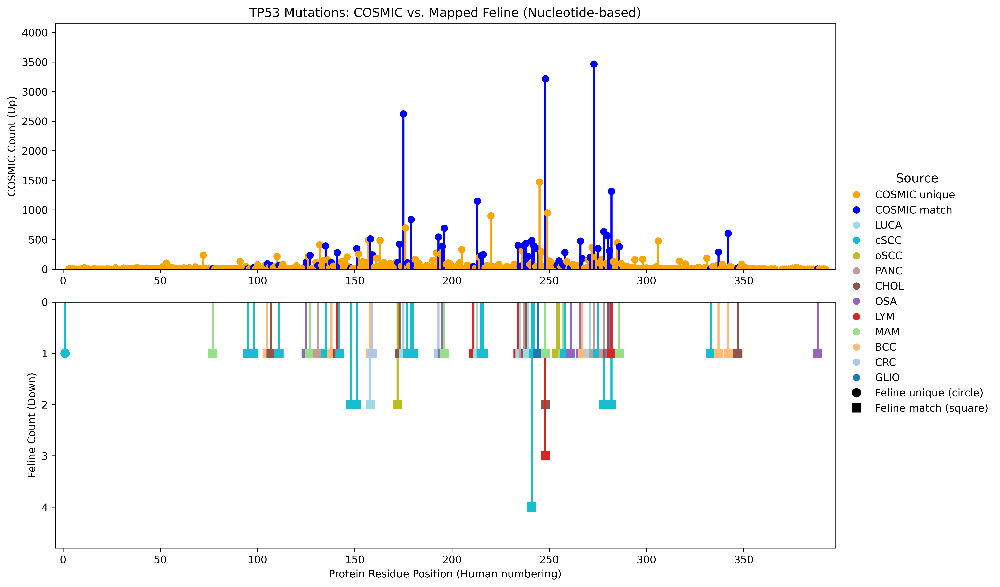

# fur2cosmic

The code, data, and results for human comparision and mutation frequecy analysis for feline FUR samples.

Code is in the form of `fur2cosmic` Python package and also standalonePython Jupyter notebooks.

|                         Main                         |                         Develop                          |
| :----------------------------------------------------: | :------------------------------------------------------: |
| [![pipeline status][main-pipe-badge]][main-branch] | [![pipeline status][develop-pipe-badge]][develop-branch] |

[main-pipe-badge]: https://gitlab.internal.sanger.ac.uk/DERMATLAS/fur/fur_to_cosmic/badges/main/pipeline.svg
[main-branch]: https://gitlab.internal.sanger.ac.uk/DERMATLAS/fur/fur_to_cosmic/-/commits/main
[develop-pipe-badge]: https://gitlab.internal.sanger.ac.uk/DERMATLAS/fur/fur_to_cosmic/badges/develop/pipeline.svg
[develop-branch]: https://gitlab.internal.sanger.ac.uk/DERMATLAS/fur/fur_to_cosmic/-/commits/develop


## Table of Contents
- [Data Directory](#data-directory)
- [Results Directory](#results-directory)
- [Usage of `fur2cosmic`](#usage-of-fur2cosmic)
  - [Plotting with `fur2cosmic`](#creating-plots-with-fur2cosmic)
  - [CLI of `fur2cosmic`](#command-line-interface-of-fur2cosmic)
- [Installation](#installation)
- [Directory Structure](#directory-structure)

## Data Directory
The `data` directory contains the data files used in the analysis.

The directory `data/fur_mafs` contain the MAF files for the feline FUR samples. Their generation is described in the
paper's supplementary methods.

The directories `data/cbioportal_mutation_proportions` and `data/cosmic`, corresponding to
resources from [CBioPortal](https://www.cbioportal.org/) and [COSMIC](https://cancer.sanger.ac.uk/cosmic)

The directory `data/feb_2025_cohorts` contains cohort data from [TCGA](https://doi.org/10.1038/s41586-020-1969-6), [MSK-IMPACT](https://doi.org/10.1038/nm.4333) and [China Pan-Cancer](https://doi.org/10.1038/s41467-022-31780-9).

## Results Directory
The `results/human-comparison` directory contains the results of the human comparison
analysis for feline mutations and contrasted with the COSMIC Cancer Mutation
Census (CMC) data. These files were generated by the `fur2cosmic` program.

The `results/supplementary-tables` directory contains the supplementary tables
generated by the Jupyter notebook [`notebooks/supplementary_tables.ipynb`](notebooks/supplementary_tables.ipynb).

The `results/mutation-frequencies` directory contains the mutation frequency
across selected genes from the FUR sample cohort against pan-cancer datasets
like TCGA and MSK-CHORD. These files were generated by the Jupyter notebook
[`notebooks/human_comparison_figure.v2.ipynb`](notebooks/human_comparison_figure.v2.ipynb).

## Usage of `fur2cosmic`

`fur2cosmic` is a program with a CLI that can map feline mutations to the
equivalent homologous position in humans and compare the humanized feline
mutations with the [COSMIC Cancer Mutation Census (CMC)](https://cancer.sanger.ac.uk/cmc/home). The
program produces a `tsv` data file and option `pdf` & `png` plots, like the one

To use the program you will need to **download CMC** from the COSMIC website.

**MAF files** expect a certain file structure and column composition, for examples please look at:
  - [`tests/example_data/example.CATD252a.maf`](tests/example_data/example.CATD252a.maf)
  - `tests/example_data/example_1.maf.gz` (a larger, compressed example)

For an example of **how to run** `fur2cosmic` see `tests/integration/test_cli.py`.

### Creating plots with `fur2cosmic`

An example of humanized feline mutations plotted by `fur2cosmic` for *TP53*.

{width=400}

### Command Line Interface of `fur2cosmic`

```
usage: fur2cosmic [-h] [-o OUTPUT_DIR] [--dpi DPI] [--skip-plots] [--use-json] [--version] GENE-SYMBOL CMC-FILE MAF-FILE [MAF-FILE ...]

Map feline mutations to human and compare with COSMIC data.

positional arguments:
  GENE-SYMBOL           HUFO gene symbol to analyze, e.g., TP53
  CMC-FILE              Path to a COSMIC Cancer Mutation Census (CMC) data file
  MAF-FILE              One or more MAF files containing feline mutations, e.g., study1.maf study2.maf

options:
  -h, --help            show this help message and exit
  -o OUTPUT_DIR, --output-dir OUTPUT_DIR
                        Directory to save the output files (default: current directory)
  --dpi DPI             DPI for saving plots (default: 600)
  --skip-plots          Skip generating comparison plots
  --use-json            Use packaged JSON data for pre-calculated nucleotide alignments not present in Ensembl API
  --version             Show the version of the package
  ```

## Installation

`fur2cosmic` is a Python package and can be installed using `pip` or with the
[`poetry`](https://python-poetry.org/docs/). It was written against Python3.10
but should work on newer Python versions as well.

```bash
python -m venv venv  # Assumes 3.10
source venv/bin/activate
pip install .  # Install from pyproject.toml
```

Or with `poetry`
```bash
python -m venv venv  # Assumes 3.10
source venv/bin/activate
poetry install  # Install from pyproject.toml, including all development dependencies
```

## Directory structure

```
.
├── .devcontainer
│   └── devcontainer.json    # Used by VSCode to create a development container
├── cicd_scripts/
│   ├── build_package_and_publish.sh       # Publishes the package to the Gitlab PyPi registry
│   └── format_test.sh       # CI/CD script to run formatting and linting
├── .dockerignore
├── .gitignore
├── .gitlab-ci.yml           # Gitlab CI/CD config file
├── .pre-commit-config.yaml  # Pre-commit config file
├── Dockerfile
├── README.md
├── docker-compose.yml
├── pyproject.toml           # Python package config file (dependencies add here)
├── poetry.lock              # Poetry dependency lock file (generated)
├── poetry.toml              # Poetry config file
├── requirements.txt         # Alternative package dependency file (generated)
├── src
│   └── fur2cosmic  # The python package of this repo (src code)
└── tests
    ├── integration          # Integration tests go here
    └── unit                 # Unit tests go here
```
